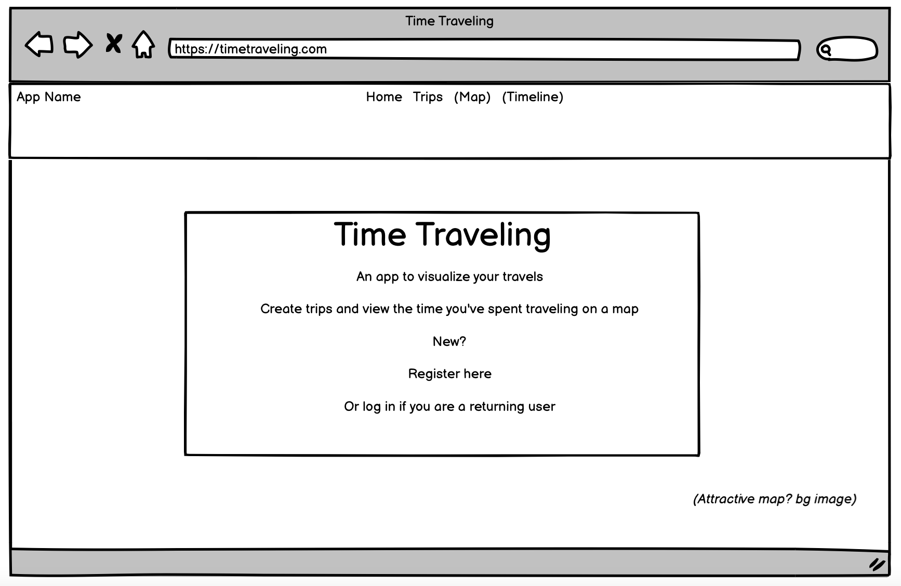
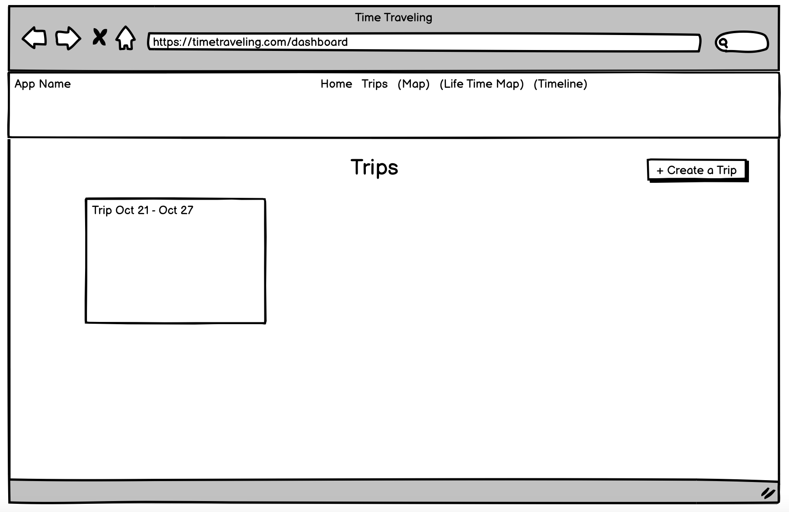
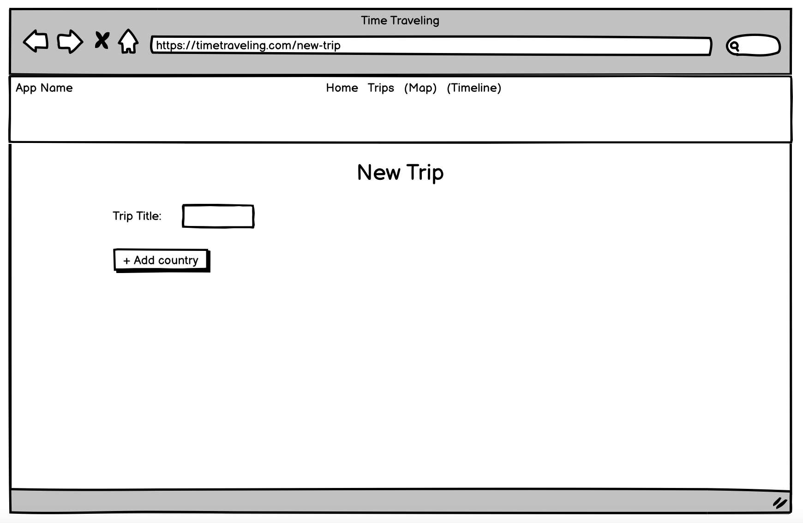
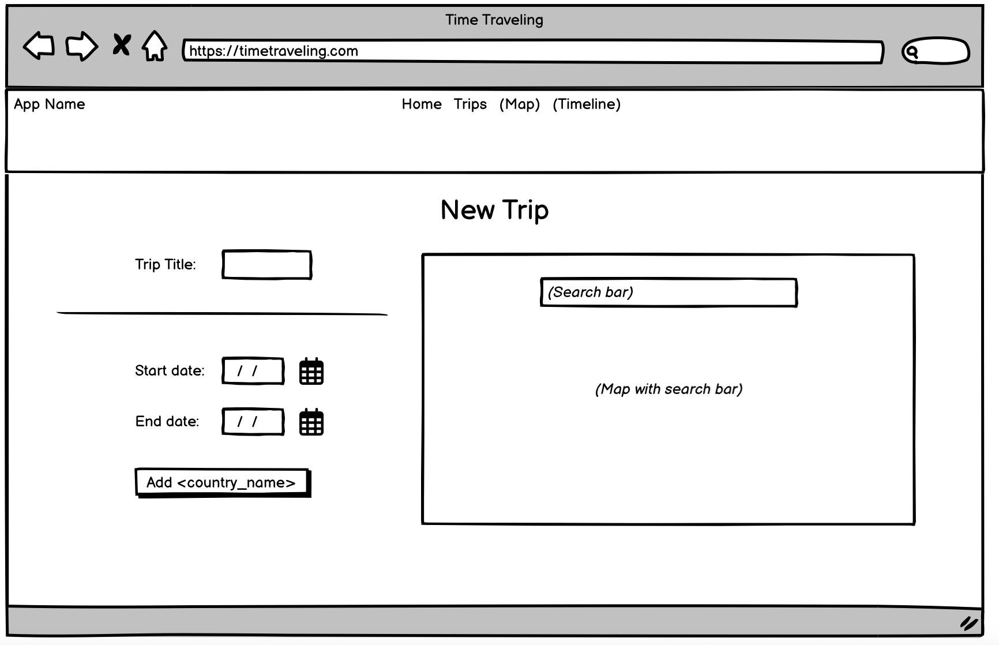
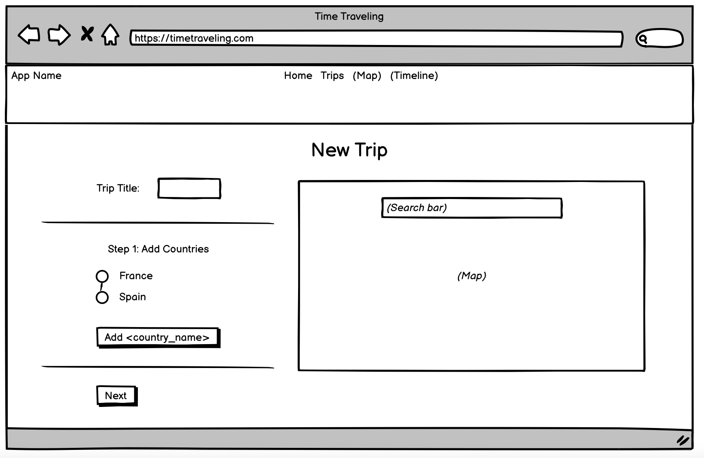
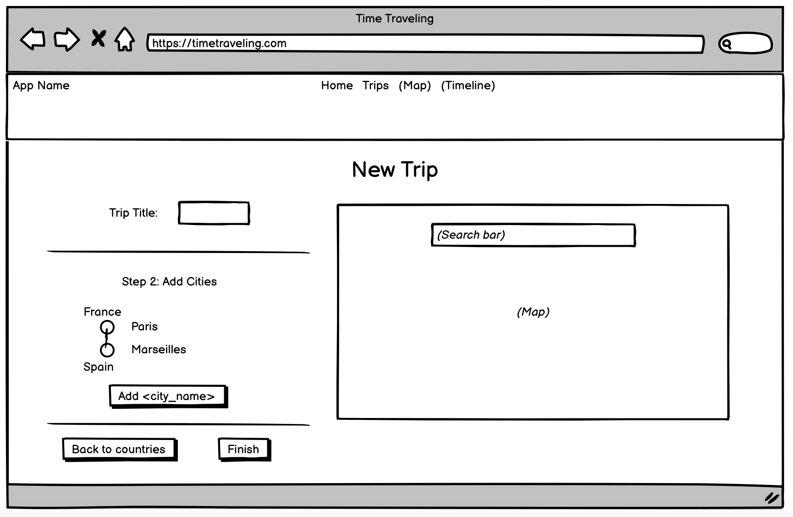
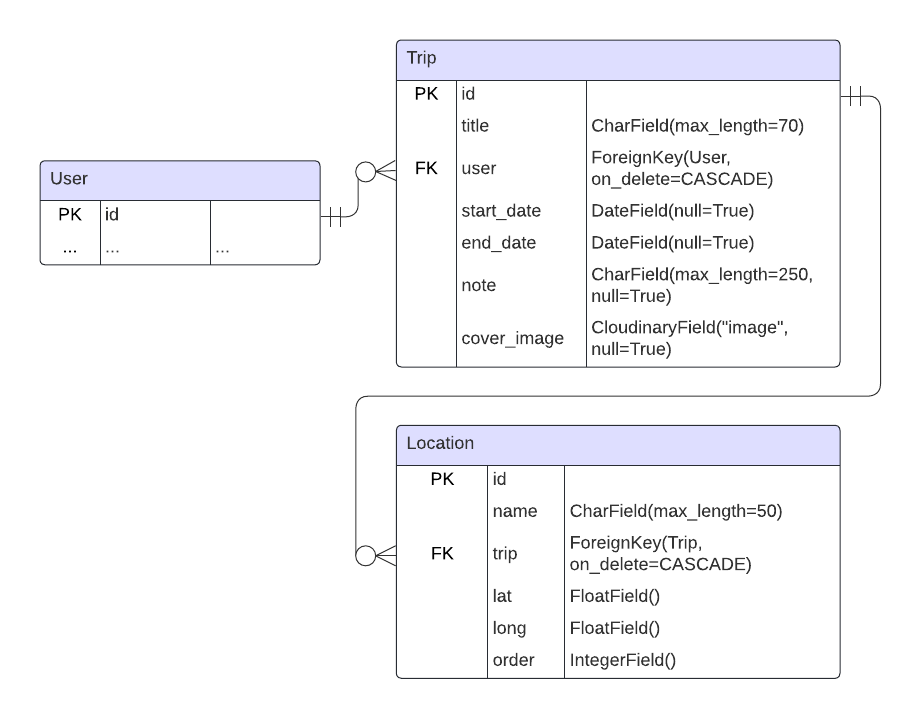

# Time Traveling

An app to visualize your travels.

This website provides a simple platform where users can visualize the paths of their trips and see where in the world they have spent their time.

View the deployed site !! here !!

## Design Process

### Strategy

The goal of this project is to allow users to create trips and view lines connecting the places they've traveled on a map. This is targeted toward anyone who travels, and some use cases for the target user might be showing others the places they've journed to, planning a trip or recording past travels.

### Scope

The MVP requires:

- authentication - users should only be able to see and change their own trips
- a dashboard view of all trips
- detail pages for each trip
- form pages to create and edit trips
- the ability to delete trips
- the ability to view trip time-space lines on a map

### Structure

The main page for logged-in users is the trips dashboard. From here, controls allow users to move to individual trip pages, create a trip, edit and delete trips. Individual trip pages also allow updating and deletion of the current trip.

The database structure contains two models, one for trips and one for locations. See the ERD section below for the models diagram.

The dashboard displays a card for each trip, showing basic information and an image (if supplied). Trip detail pages show all the supplied data for a trip and its associated locations, as well as a map showing the time-space line.

In order not to fill the page with too much information, the trip and the locations are created on separate pages. A trip record is created first, and if sucessfully submitted will redirect to the locations page with a searchable map.

Since it would be poor user experience to redirect to a new form page for every location in a trip, location record CRUD functionality is all completed in one view and on one page using a formset.

### Skeleton

Wireframes were created using [Balsamiq](https://balsamiq.com/) (see Wireframes section below for images).

### Surface

The site uses a dark background to contrast with and highlight the images and maps, since these visual elements are the focus of the site surface. The trips dashboard, especially, emulates a photo book in this way, emphasizing the trip cards.

The main theme color is a shade of green (#34825f), which reflects a natural color palette and contrasts well with the dark background. Orange (#ffa500) is used for the time-space lines as a complementing secondary theme color and to stand out against the map background.

[Lato](https://fonts.google.com/specimen/Lato) is the main font, used in the logo and across the site and chosen for its clean, modern look. [Nothing You Could Do](https://fonts.google.com/specimen/Nothing+You+Could+Do) is used a secondary font, to provide variety, and again to suggest a trip photo book where one might handwrite information. [Coromorant Garamond](https://fonts.google.com/specimen/Cormorant+Garamond) is used as a back-up font.

A map icon is used in the logo and as the favicon.

### Wireframes

Note: these wireframes reflect the initial idea for the project, which used two different types of trips - see Future Features below for more details. The form page wireframes above have two separate steps for adding countries and then cities. This was removed from the project plan, but otherwise the skeleton was implemented as shown.

### Models Entity Relationship Diagram

## Features

### Dashboard

!! Sample dashboard image !!

The dashboard displays all trips that a user has created. Each trip is contained in a card showing a cover image, the title and dates of the trip. Clicking on a card image or title brings the user to a trip detail page.

Users can add trips by clicking the button at the top. When the "edit trips" button is clicked, control buttons expand under each card to allow the user to update or delete the trip.

### Trip detail page

This page displays all supplied data from a trip and a list of its associated locations. A map displays a time-space line connecting the trip locations. Buttons next to the trip title allow for editing and deleting.

### Trip CRUD pages

To create or update a trip, the user is first brought to a form to create or update the trip record (locations are handled on the following page).

!! Create trip form !!
!! Edit trip form !!

When creating a trip, an empty form is displayed; when updating, the form is prefilled with trip information.

Only the title field is required. An image can be uploaded from the user's device.

Trip deletion doesn't open a separate page, but a modal is opened in the dashboard or trip detail page to confirm deletion before submitting the request to the database.

!! Confirm deletion modal !!

### Locations page

Locations are added and changed on a new page following successful submission of the trip form.

!! Locations starting page !!

Users can search for locations in the search bar and select one to view it on the map.

!! Search bar with entry !!

On clicking "Add", the location will be added to the list. A time-space line is generated as the user adds locations.

!! Locations page with several entries and line !!

Locations can be reordered by picking them up and dragging them in the list, and deleted by clicking the menu icon to the right and selecting "Delete". These changes are updated on the map line.

On clicking "Save Locations", the user is redirected to the detail page for the trip.

### Authentication

!! Welcome page image !!
!! Log in page image !!

Users need to be logged in to create trips, and can only view and update their own trips.

## Future Features

### Structured and custom trips

The initial ideas for this project included two types of trips:

- Structured - after creating a trip, the user selects a series of countries, and then a series of cities/towns within each country. This way, when viewing a map of their lifetime, the user could choose to view their life time-space line by country or by city. These trips would also be prevented from overlapping timewise.
- Custom - the user can add any type of location to the the trip sequence, and dates are not required or enforced to be non-overlapping. This allows for more freedom.

For the MVP version of this project, it made more sense to implement the custom trip, which gives the user more control of the creation of their trips. This type can also be used for trip planning since dates aren't required.

However, the structured trip model would be a useful future feature since it would allow users to view their travels in different contexts and at different levels of detail.

### Dynamic lines

To emphasize the time dimension of traveling, a further feature would be to make the map lines dynamic - "draw" them along the path of the trip. This would allow the user to see the path of their travels more clearly, along time as well as space.

## Technologies Used

- [Django (v3.2)](https://docs.djangoproject.com/en/3.2/)
- OpenStreetMaps
- Leaflet
- [Bootstrap (v5.3)](https://getbootstrap.com/docs/5.3/getting-started/introduction/)
- [Cloudinary](https://cloudinary.com/) - media storage
- [ElephantSQL](https://www.elephantsql.com/) - external database

### Libraries

Database connection:

- dj_database_url
- psycopg2

Authentication:

- [django-allauth (0.44.0)](https://docs.allauth.org/en/latest/)

Front-end controls:

- Datepicker - [bootstrap-datepicker](https://github.com/uxsolutions/bootstrap-datepicker)
- Sortable list - [jQuery UI](https://jqueryui.com/)

Map search and autocomplete:

- [Leaflet.Autocomplete](https://github.com/tomickigrzegorz/Leaflet.Autocomplete)

Deployment server:

- gunicorn

## Bug Fixes

## Testing

## Deployment

The project is deployed on [Heroku](https://heroku.com/).

### Code changes before deployment

Store project dependencis by running:

`pip3 freeze --local > requirements.txt`

### Deployment steps

A Heroku account is required.

Steps to deploy:

- Create a new app from the Heroku dashboard
- Give the app a name and select a region
- In Settings, go the the Config Vars section and add environment variables and project credentials such as secret keys, database urls and allowed host urls
- In Deploy, select the GitHub deployment method, then:
    - Connect to GitHub
    - Search for the repository name and click 'Connect'
    - Set up automatic deploys or manually deploy
- Once the app build has completed, click 'View' to open the deployed project

## Attributions

- Logo and favicon - [Logo.com](https://logo.com/)
- Main background - [Image by GarryKillian](https://www.freepik.com/free-vector/terrain-big-data-visualization_7941096.htm#query=dark%20map&position=0&from_view=search&track=ais&uuid=7850fb46-cc4c-401c-bb49-be112d860467) on Freepik
- Fonts - [Google Fonts](https://fonts.google.com/)