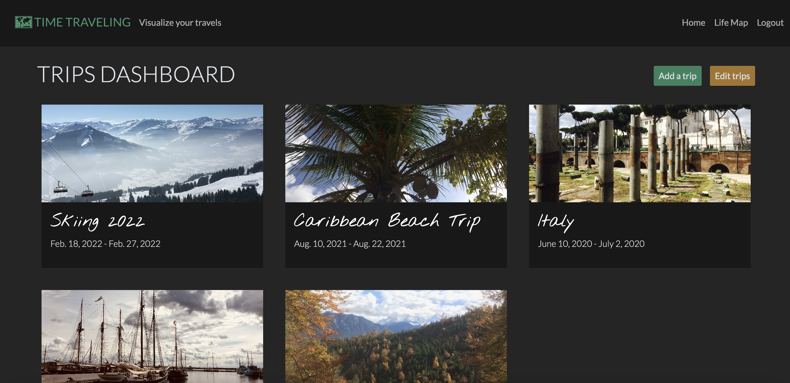
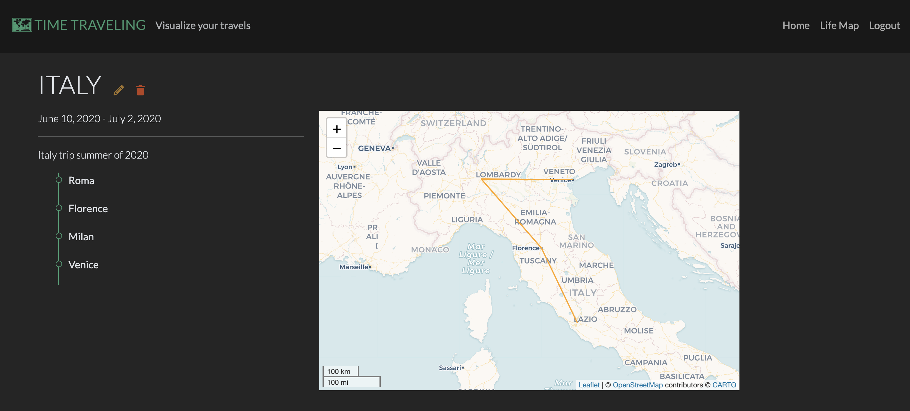
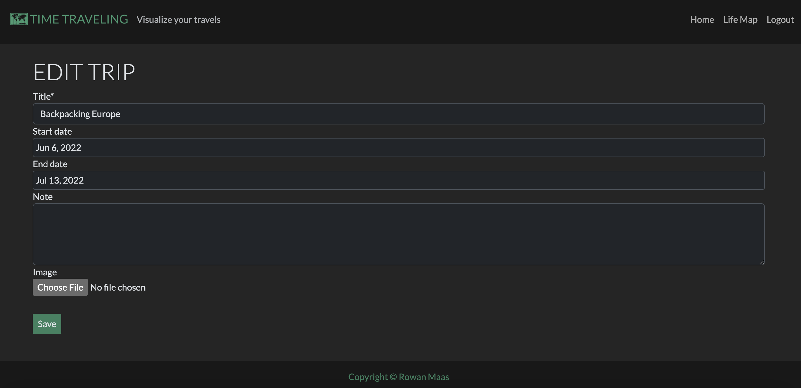
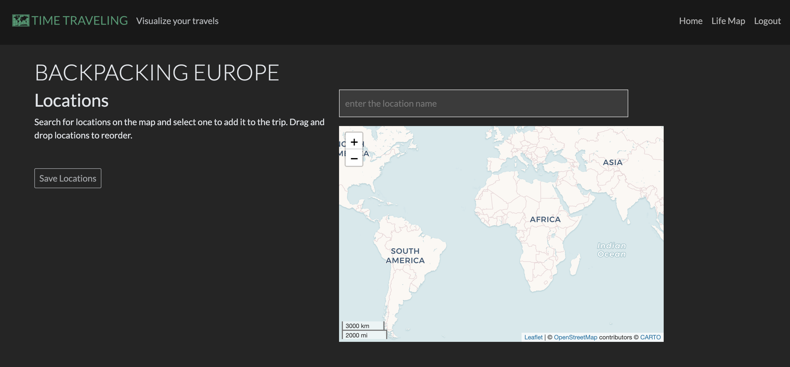
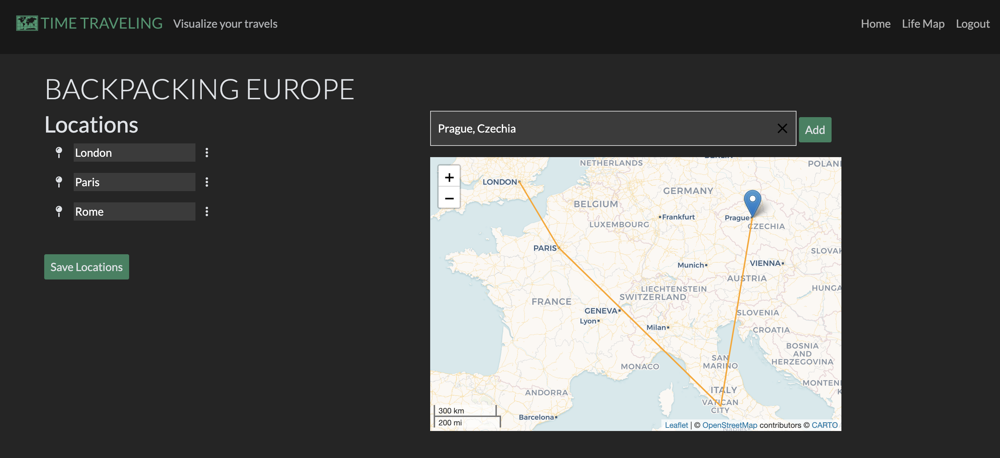
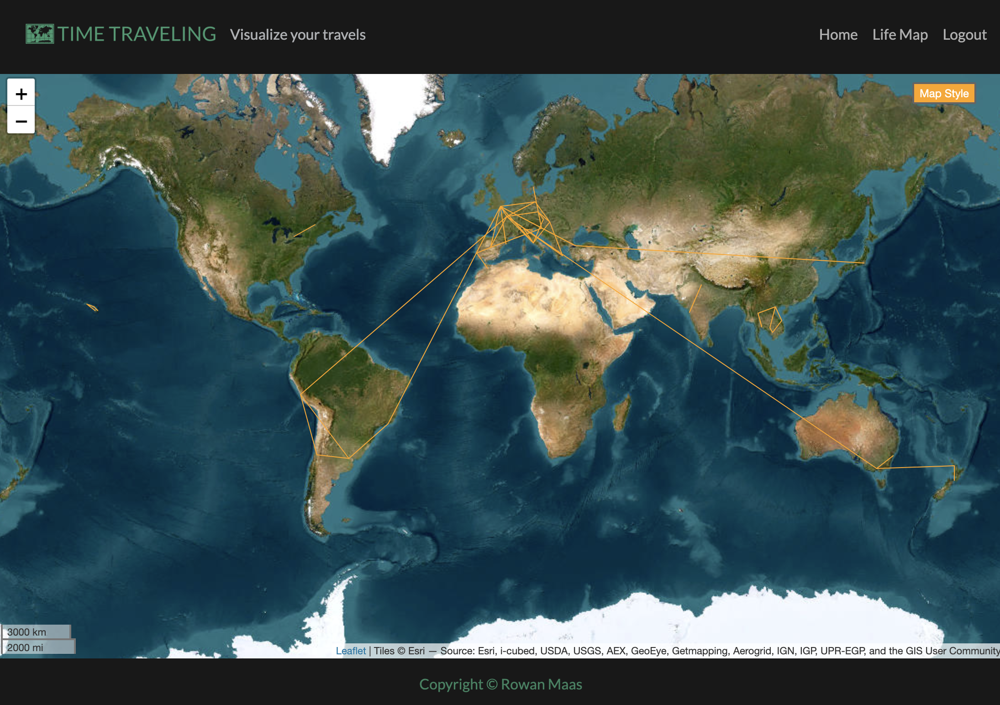
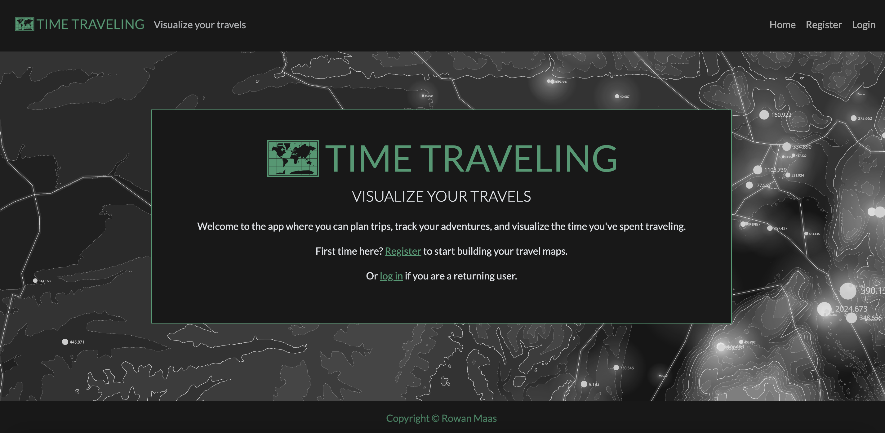
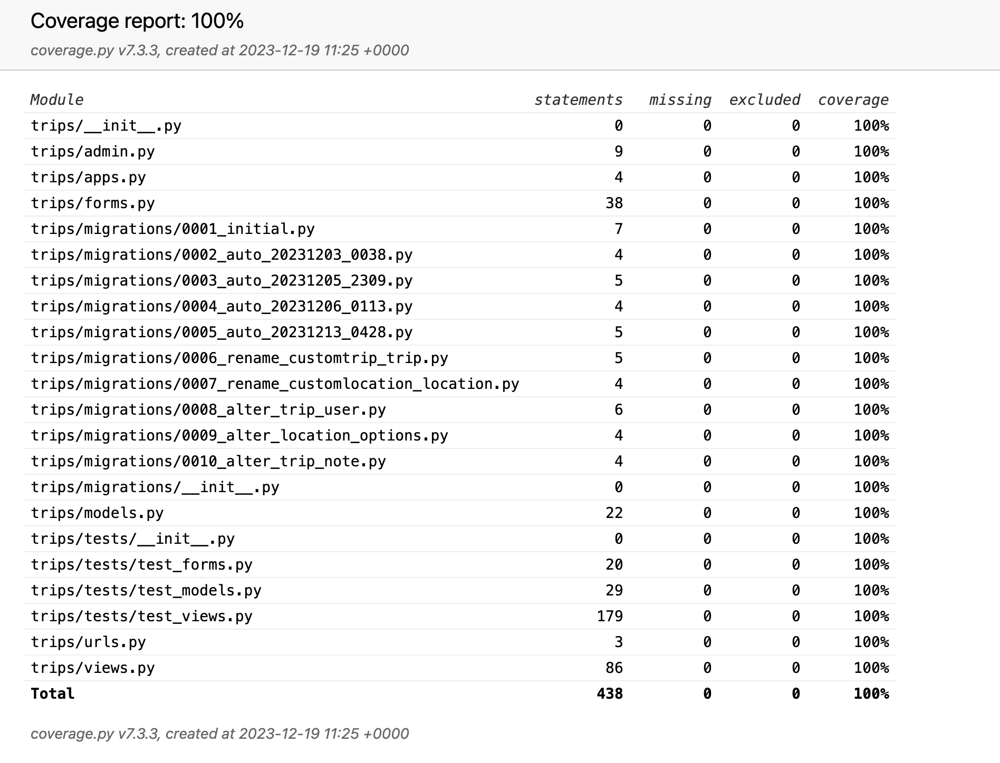
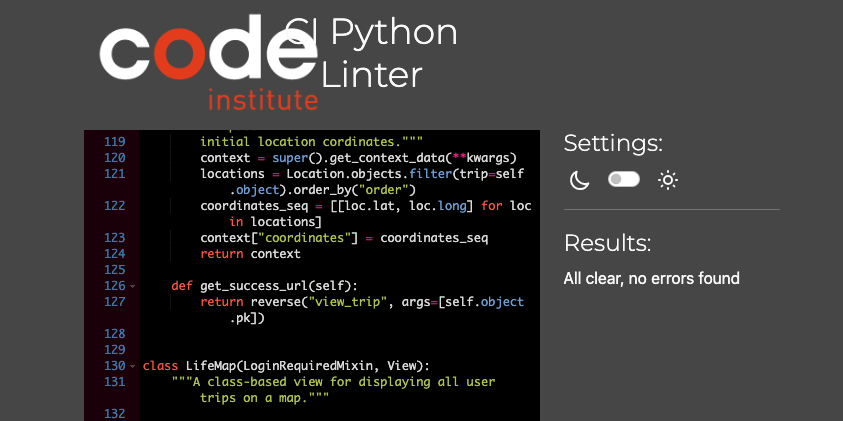
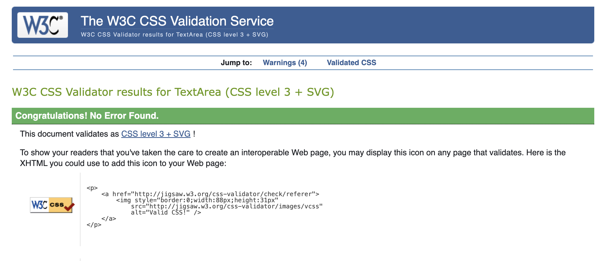

# Time Traveling

An app to visualize your travels.

This website provides a simple platform where users can visualize the paths of their trips and see where in the world they have spent their time.

View the deployed site - [Time Traveling](https://time-traveling-097e0483a4a8.herokuapp.com/)

## Design Process

### Strategy

The goal of this project is to allow users to create trips and view lines connecting the places they've traveled on a map. This is targeted toward anyone who travels, and some use cases for the target user might be showing others the places they've journed to, planning a trip or recording past travels.

### Scope

The MVP requires:

- authentication - users should only be able to see and change their own trips
- a dashboard view of all trips
- detail pages for each trip
- form pages to create and edit trips
- the ability to delete trips
- the ability to view trip time-space lines on a map

### Structure

The main page for logged-in users is the trips dashboard. From here, controls allow users to move to individual trip pages, create a trip, edit and delete trips. Individual trip pages also allow updating and deletion of the current trip.

The database structure contains two models, one for trips and one for locations. See the ERD section below for the models diagram.

The dashboard displays a card for each trip, showing basic information and an image (if supplied). Trip detail pages show all the supplied data for a trip and its associated locations, as well as a map showing the time-space line.

In order not to fill the page with too much information, the trip and the locations are created on separate pages. A trip record is created first, and if sucessfully submitted will redirect to the locations page with a searchable map.

Since it would be poor user experience to redirect to a new form page for every location in a trip, location record CRUD functionality is all completed in one view and on one page using a formset.

### Skeleton

Wireframes were created using [Balsamiq](https://balsamiq.com/) (see Wireframes section below for images).

### Surface

The site uses a dark background to contrast with and highlight the images and maps, since these visual elements are the focus of the site surface. The trips dashboard, especially, emulates a photo book in this way, emphasizing the trip cards.

The main theme color is a shade of green (#34825f), which reflects a natural color palette and contrasts well with the dark background. Orange (#ffa500) is used for the time-space lines as a complementing secondary theme color and to stand out against the map background.

[Lato](https://fonts.google.com/specimen/Lato) is the main font, used in the logo and across the site and chosen for its clean, modern look. [Nothing You Could Do](https://fonts.google.com/specimen/Nothing+You+Could+Do) is used a secondary font, to provide variety, and again to suggest a trip photo book where one might handwrite information. [Coromorant Garamond](https://fonts.google.com/specimen/Cormorant+Garamond) is used as a back-up font.

A map icon is used in the logo and as the favicon.

### Wireframes

Note: these wireframes reflect the initial idea for the project, which used two different types of trips - see Future Features below for more details. The form page wireframes above have two separate steps for adding countries and then cities. This was removed from the project plan, but otherwise the skeleton was implemented as shown.

### Models Entity Relationship Diagram

## Features

### Dashboard

The dashboard displays all trips that a user has created. Each trip is contained in a card showing a cover image, the title and dates of the trip. Clicking on a card image or title brings the user to a trip detail page.

Users can add trips by clicking the button at the top. When the "edit trips" button is clicked, control buttons expand under each card to allow the user to update or delete the trip.

### Trip detail page

This page displays all supplied data from a trip and a list of its associated locations. A map displays a time-space line connecting the trip locations. Buttons next to the trip title allow for editing and deleting.

### Trip CRUD pages

To create or update a trip, the user is first brought to a form to create or update the trip record (locations are handled on the following page).

When creating a trip, an empty form is displayed; when updating, the form is prefilled with trip information.

Only the title field is required. An image can be uploaded from the user's device.

Trip deletion doesn't open a separate page, but a modal is opened in the dashboard or trip detail page to confirm deletion before submitting the request to the database.

### Locations page

Locations are added and changed on a new page following successful submission of the trip form. Users can search for locations in the search bar and select one to view it on the map.

On clicking "Add", the location will be added to the list. A time-space line is generated as the user adds locations.

Locations can be reordered by picking them up and dragging them in the list, and deleted by clicking the menu icon to the right and selecting "Delete". These changes are updated on the map line.

On clicking "Save Locations", the user is redirected to the detail page for the trip.

### Life Map

The user can view a world map with all of their created trips. A button toggles between a political and a geographical map style.

### Authentication

Users need to be logged in to create trips, and can only view and update their own trips.

## Future Features

### Structured and custom trips

The initial ideas for this project included two types of trips:

- Structured - after creating a trip, the user selects a series of countries, and then a series of cities/towns within each country. This way, when viewing a map of their lifetime, the user could choose to view their life time-space line by country or by city. These trips would also be prevented from overlapping timewise.
- Custom - the user can add any type of location to the the trip sequence, and dates are not required or enforced to be non-overlapping. This allows for more freedom.

For the MVP version of this project, it made more sense to implement the custom trip, which gives the user more control of the creation of their trips. This type can also be used for trip planning since dates aren't required.

However, the structured trip model would be a useful future feature since it would allow users to view their travels in different contexts and at different levels of detail.

### Dynamic lines

To emphasize the time dimension of traveling, a further feature would be to make the map lines dynamic - "draw" them along the path of the trip. This would allow the user to see the path of their travels more clearly, along time as well as space.

## Technologies Used

- [Django (v3.2)](https://docs.djangoproject.com/en/3.2/)
- [Bootstrap (v5.3)](https://getbootstrap.com/docs/5.3/getting-started/introduction/)
- [OpenStreetMap](https://www.openstreetmap.org/#map=10/51.4898/-0.0882)
- [Leaflet](https://leafletjs.com/)
- [Cloudinary](https://cloudinary.com/) - media storage
- [ElephantSQL](https://www.elephantsql.com/) - external database

### Languages

- Python
- JavaScript
- HTML5/CSS3

### Libraries

- [jQuery](https://jquery.com/)

Database connection:

- [dj_database_url](https://pypi.org/project/dj-database-url/)
- [psycopg2](https://pypi.org/project/psycopg2/)

Formset views:

- [django-extra-views](https://django-extra-views.readthedocs.io/en/latest/)

Authentication:

- [django-allauth (0.44.0)](https://docs.allauth.org/en/latest/)

Front-end controls:

- Datepicker - [bootstrap-datepicker](https://github.com/uxsolutions/bootstrap-datepicker)
- Sortable list - [SortableJS](https://github.com/SortableJS/Sortable)

Map search and autocomplete:

- [Leaflet.Autocomplete](https://github.com/tomickigrzegorz/Leaflet.Autocomplete)

Other:

- [gunicorn](https://gunicorn.org/)
- [coverage](https://coverage.readthedocs.io/en/7.3.3/)
- [django-crispy-form](https://django-crispy-forms.readthedocs.io/en/latest/)
- Map tile providers, taken from [leaflet-providers](https://leaflet-extras.github.io/leaflet-providers/preview/)

## Bug Fixes

### Sortable list on touchscreen

The jQuery UI plugin used to make the locations list re-orderable by dragging does not have support for touchscreen devices. This issue was fixed by switching to a different JavaScript library, SortableJS, which enables the list sorting functionality to be accessible on touchscreen.

### Image uploading by user

When a model image field was first implemented with Cloudinary, images could be uploaded from the admin site but not from the useable site itself. This turned out to simply be due to the lack of the enctype attribute on the form.

### Static files not loading in deployment

On the second major deployment, after the bulk of the project had been built, the background image and JavaScript files weren't loading on the deployed site. This was fixed by replacing the file paths with absolute paths.

### Location forms with empty names

During some testing attempts, if a user added a location, removed the name and then deleted the location, this would cause form submission issues since the name is required but the form gets hidden on deletion and the user can no longer see which location they selected. This was bypassed by filling the name with deletion-related text to ensure it was non-empty.

While fixing this issue, it was discovered that if a location name was deleted and the form then submitted, the page would reload with all empty fields on the bottom of the page, meaning the user could no longer see where they had been placed in the list. The required attribute was added to name fields to ensure form validation before the form can be submitted, thereby avoiding reloading issues.

### Dashboard cover images filling cards

The cover images on the trip dashboard initially showed some background color on certain device sizes. This was fixed by setting both the height and width of the images so that the object-fit property could work correctly.

### Responsive layouts

The website was developed primarily for laptop use so there were several display and styling issues on mobile screen sizes. These were fixed by changging the Bootstrap classes and adding some custom styling.

## Testing

### Unit Tests

#### Python Testing

All unit tests passed and [coverage](https://coverage.readthedocs.io/en/7.3.3/) returned 100%.

### User Testing

#### JavaScript Testing

Most pages don't use significant amounts of JavaScript, and the small amounts of use for those are covered in the User Story testing steps below. The three main pages that use significant JavaScript are updating locations and rendering the trip maps and life time maps. Specific testing of the JavaScript functionality of those pages is described here.

Update Locations JavaScript

| Expectation                       | Met |
| --------------------------------- | --- |
| Map displays | yes |
| Map maintains aspect ratio and resizes at breakpoints | yes |
| Search bar displays | yes |
| If locations list is empty, instructions are displyed | yes |
| If locations list is empty, "Save Locations" is disabled | yes |
| When a location is entered, a list of options appears | yes |
| When an option is selected, a marker is added to the map | yes |
| When an option is selected, an "add" button appears | yes |
| When "add" is clicked, the location is added to the locations list | yes |
| The marker then disappears from the map | yes |
| The "add" button disappears | yes |
| If there are at least 2 locations, a polyline is drawn on the map connecting all locations | yes |
| Locations are connected in the correct order | yes |
| A menu is displayed next to each location with a delete option | yes |
| When clicked, the location is removed from the list | yes |
| The location is also removed from the map line | yes |
| If there is one or no locations left in the list, the polyline disappears | yes |
| Locations can be clicked and dragged to reorder them | yes |
| When a location is dropped to a new position, its order is also updated on the map | yes |
| The name field can be changed by the user | yes |
| When "Save Locations" is clicked, all of the above changes are saved correctly | yes |
| When the locations page is opened to edit a trip, all exisiting locations are displayed in the list and on the map, in the correct order | yes |

Life Time Map

| Expectation                       | Met |
| --------------------------------- | --- |
| Map renders | yes |
| Map is displayed over the entire page | yes |
| All of the logged in user's trips are displayed on the map | yes |
| Only the current user's trips are displayed | yes |

Trip Detail Map

| Expectation                       | Met |
| --------------------------------- | --- |
| Map renders | yes |
| Map maintains aspect ratio and resizes at breakpoints | yes |
| The locations in the current trip are connected by a line on the map in the correct order | yes |

#### Testing User Stories

Registration

Creating a trip

- Clicking either of the "Create a trip" or "Add a trip" buttons brings user to the New Trip form
- The form is displayed correctly with all fields and a submit button
- The form cannot be submitted without a title
- A title longer than 70 characters cannot be entered
- When the start date or end date fields are clicked on, a datepicker appears. The user can move between different months and years in the datepicker. 
- When a date is clicked in the picker, it is added to the field, in the correct string formatting
- If only a start date is supplied, an error message under the end date field informs the user that this field is required. The same happens vice versa if only an end date is supplied.
- If the end date is before the start date, an error message under the date informs the user that the end date must be after the star date
- A note can be added, and a note longer than 50 characters cannot be entered
- An image can be uploaded by the user
- On clicking submit, the user is redirected to the locations page and a success message is flashed

Adding locations

- The trip title is displayed on the page along with a map and a search bar
- There are instructions telling the user that locations can be added from the map search and that location are reorderable by dragging. The "Save Locations" button is initially disabled.
- When the user clicks on the search bar and types in a place name, a list of places appears. When one is clicked, a marker is displayed on the map and an "Add" button appears next to the search bar.
- The map can be zoomed and moved around
- When the user clicks "Add", the location is added to the locations list. The instructions disappear and the submit button is enabled. The marker disappears from the map and the "Add" button next to the search bar disappears.
- When a second location is selected, a line appears on the map connecting the two locations. If the user changes the location, the line updates accordingly. When the user clicks add, the second location is added to the locations list.
- The user can continue adding locations in this way. The locations list is updated with each item and the map line also updates.
- The locations can be reordered by picking them up by the pin icon and dragging and dropping (they can also be picked up from anywhere else on the list item). The map line updates accordingly, connecting the locations in the correct order.
- Each location has a menu to its right. When clicked, a delete option is shown. When this is selected, the location is removed from the list and from the map line.
- Locations can be renamed by clicking on the name field and typing. A name longer than 50 characters is prevented.
- The form cannot be submitted if a name field is empty
- When "Save Locations" is clicked, the user is redirected to the trip detail page

Trip detail page

- All supplied trip information is displayed - title, dates and note if supplied, and locations (the cover image is only displayed on the dashboard)
- A list of locations is displayed, in the correct order. Locations that were deleted from the form page are not displayed. 
- A map is displayed, showing the correct time-space line for the trip. The map can be zoomed and moved around.
- There is a pen icon button that takes the user to an Edit Trip page, with the same form as previously but prefilled with the trip data
- There is also a trash can icon button that open a modal asking the user to confirm trip deletion. On confirmation, the user is redirected to the dashboard where a confirmation message is flashed. The trip is no longer displayed on the dashboard.
- The icons are responsive and get larger on hovering

Dashboard

- When a user has at least one trip, the introductory message is removed from the dashboard and an "Edit trips" button is added to the top of the screen
- All user trips are displayed on the dashboard, and only that user's trips
- Each trip is displayed in a card with the cover image, if supplied (otherwise a gradient background is added), the trip title and trip dates (if supplied)
- Trip cards (specifically, the image and title) can be clicked on to view trip detail pages
- The trips are sorted by date, with the most recent dates first, and with undated trips at the end
- Trip cards are displayed in 1, 2 or 3 columns depending on screen size
- Clicking on "Edit trips" displays a pen and a trash can icon at the bottom of each card. Clicking on the pen icon brins the user to the prefilled trip form page. Clicking on the trash can icon brings up the deletin confirmation modal. On confirmation, the trip disappears from the dashboard and a confirmation message is flashed.
- Clicking on "Add a trip" opens the add trip form page

Updating a trip

- The Edit Trip page contains the same form as Add Trip, with data prefilled
- The same validation (required title and date validation) is enforced on this page
- A new image file can be uploaded, and on saving, the new image is shown on the dashboard
- On clicking submit, the user is redirected to the locations page and a success message is flashed

Updating locations

- The existing trip location are displayed in the list, and the connecting line is shown on the map
- If a new location is added, this is added to the trip list and map
- The new location can be reordered the same as the pre-existing locations
- If a new location is added, and both it and a pre-existing location are then deleted and the form saved, the trip will save correctly
- If locations are deleted so that there is only one left, the trip line is removed
- Clicking "Save locations" redirects to the trip detail page, saves the locations correctly and flashes a success message

Deleting a trip

- A trip can be deleted from the dashboard or the trip detail page
- In both case, a modal is displayed asking for confirmation
- On confirming, the user is redirected to the dashboard and a success message is flashed
- The deleted trip is no longer displayed

Life Map page

- There is a link to the life map page in the navbar
- The page displays a map that takes up the entire screen between the header and footer
- All of the user's time-space lines are displayed on the map, and only that user's trips
- A button in the top right corner can be clicked to toggle between a political and a geographical map style
- The map can be zoomed and moved around

Logging out/logging in

- A logout button is visible in the navbar for logged in users
- On clicking, the user is brought to a log out confirmation page
- On confirming, the welcome page is displayed with registration and log in links
- For logged out users, the navbar displays register and log in links
- On clicking, the user is brough to a log in page, and from there to the dashboard
- Success messages are flashed on log in and log out
- All authentication pages have consistent styles with the rest of the site

404 and unauthorized use

- If the user searches for a url that doesn't exist, a 404 page is displayed with a link to return home
- If a logged out user tries to access a page that requires login, they are redirected to the log in page

The above testing steps were carried out on both a laptop and a mobile phone.

Using Google Developer tools, page layouts, buttons, responsiveness and element displays were tested across the range of device sizes.

### Validation and linting

- Python files were run through [CI Python Linter](https://pep8ci.herokuapp.com/) with no significant errors

- JavaScript files were run through [jshint](https://jshint.com/) with no significant errors

- CSS was passed through the official [Jigsaw](https://jigsaw.w3.org/css-validator/validator) validator with no significant errors

## Deployment

The project is deployed on [Heroku](https://heroku.com/).

### Code changes before deployment

Store project dependencis by running:

`pip3 freeze --local > requirements.txt`

### Deployment steps

A Heroku account is required.

Steps to deploy:

- Create a new app from the Heroku dashboard
- Give the app a name and select a region
- In Settings, go the the Config Vars section and add environment variables and project credentials such as secret keys, database urls and allowed host urls
- In Deploy, select the GitHub deployment method, then:
    - Connect to GitHub
    - Search for the repository name and click 'Connect'
    - Set up automatic deploys or manually deploy
- Once the app build has completed, click 'View' to open the deployed project

## Attributions

- Logo and favicon - [Logo.com](https://logo.com/)
- Main background - [Image by GarryKillian](https://www.freepik.com/free-vector/terrain-big-data-visualization_7941096.htm#query=dark%20map&position=0&from_view=search&track=ais&uuid=7850fb46-cc4c-401c-bb49-be112d860467) on Freepik
- Fonts - [Google Fonts](https://fonts.google.com/)